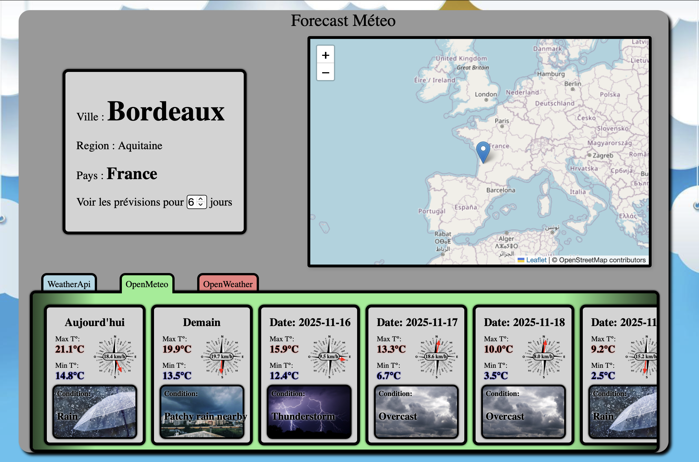

# Agrégateur Météo en Java 


Application en ligne de commande (Java) qui interroge 3 fournisseurs météo (WeatherAPI, Open‑Meteo, OpenWeather) et affiche:
- les prévisions dans le terminal,
- une page HTML locale mise à jour (interface graphique).

Un petit serveur Node.js facultatif sert l'interface web sur `http://localhost:8080` et permet de lancer l'application Java avec des paramètres depuis le navigateur.

## Sommaire
- [Pré‑requis](#pré‑requis)
- [Installation](#installation)
- [Configuration des clés API (sécurité)](#configuration-des-clés-api-sécurité)
- [Lancer en ligne de commande](#lancer-en-ligne-de-commande)
- [Lancer avec l'interface web](#lancer-avec-linterface-web)
- [Tests et couverture (optionnel)](#tests-et-couverture-optionnel)
- [Arborescence utile](#arborescence-utile)

## Pré‑requis
- Java (JDK) 11 ou supérieur.
- macOS/Linux/Windows. Gradle n'est pas requis: le wrapper `gradlew` est fourni.
- Node.js 18+ si vous voulez l'interface web (facultatif).

## Installation
Clonez ce dépôt puis installez (le wrapper Gradle s'occupe du build):

```bash
# Compilation
./gradlew build
```

Si vous utilisez l'interface web, installez les dépendances Node:

```bash
npm install
```

## Configuration des clés API (sécurité)
Les clés ne sont pas versionnées. Créez un fichier `.config` à la racine à partir de l'exemple fourni:

```bash
cp .config.example .config
# Éditez .config et remplacez par vos vraies clés
```

Clés utilisées:
- `API_KEY_WeatherAPI` pour WeatherAPI
- `API_KEY_OPENWEATHER` pour OpenWeather (sert aussi pour la géolocalisation utilisée par Open‑Meteo)

Le fichier `.config` et `cache.json` sont ignorés par Git (voir `.gitignore`). Aucune clé n'est présente dans le dépôt.

## Lancer en ligne de commande
Le programme attend 2 arguments: `VILLE` et `N_JOURS`.

Exemples:
```bash
# Exemple simple
./gradlew run --args="Bordeaux 3"

# Ville avec espace (gardez les quotes simples à l'intérieur des doubles quotes)
./gradlew run --args="'New York' 5"
```

Sorties:
- Console: prévisions des trois APIs.
- HTML: `src/main/ressources/index.html` mis à jour à partir de `template.html`.

## Lancer avec l'interface web
Le serveur Node.js sert l'interface sur `http://localhost:8080` et délègue l'exécution Java au wrapper Gradle.

1) Installer les dépendances (une seule fois):
```bash
npm install
```

2) Démarrer le serveur:
```bash
npm start
# ou
node server.js
```

3) Ouvrir le navigateur sur:
- http://localhost:8080

Vous pouvez y saisir la ville et le nombre de jours; le serveur appellera `./gradlew run --args=...` en arrière‑plan et rafraîchira la page.

Astuce: pour ouvrir automatiquement la page HTML à chaque exécution Java, décommentez la dernière ligne du fichier `src/main/java/eirb/pg203/display/DisplayService.java`:

```java
// OpenHTML.openHtmlFile(filepath); -> OpenHTML.openHtmlFile(filepath);
```

## Tests et couverture (optionnel)
Si vous avez cloné aussi les tests (non requis à l'utilisation), vous pouvez les exécuter:
```bash
./gradlew test
./gradlew jacocoTestReport
```
Le rapport de couverture (si généré) se trouve dans:
- `build/reports/jacoco/test/html/index.html`

## Arborescence utile
- `build.gradle` — configuration Gradle
- `gradlew`, `gradlew.bat`, `gradle/wrapper` — wrapper Gradle
- `src/main/java/eirb/pg203/**` — code Java de l'application
- `src/main/ressources/**` — fichiers HTML/CSS/JS et templates
- `server.js` — serveur Node.js facultatif (interface web)
- `.config.example` — modèle à copier en `.config` (clés API)
- `.gitignore` — exclut les artefacts de build et les secrets

## Notes
- Le cache d'appels (`cache.json`) est créé dynamiquement et ignoré par Git.
- Open‑Meteo n'exige pas de clé propre, mais nécessite la géolocalisation (lat/lon) fournie via l'API OpenWeather; d'où l'usage de `API_KEY_OPENWEATHER`.
- Si `./gradlew` n'est pas exécutable: `chmod +x ./gradlew`.
